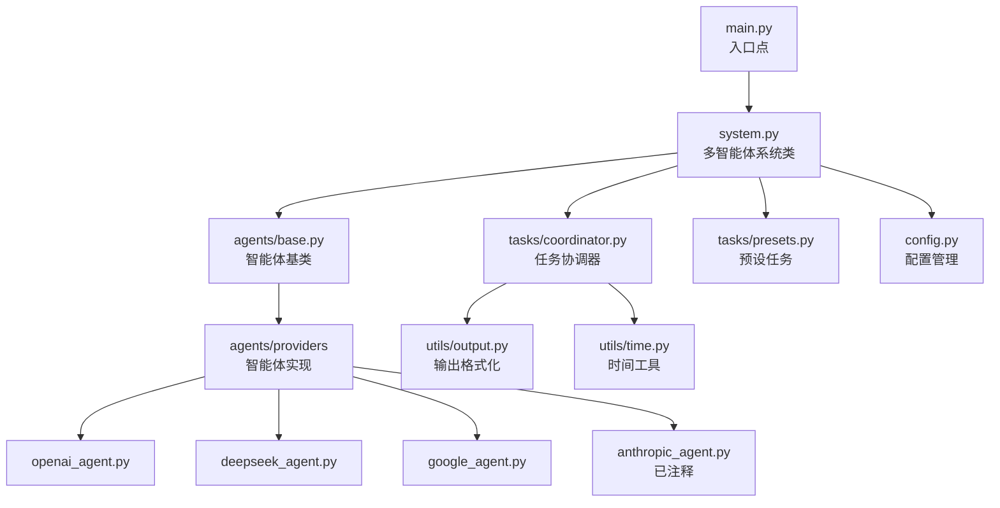
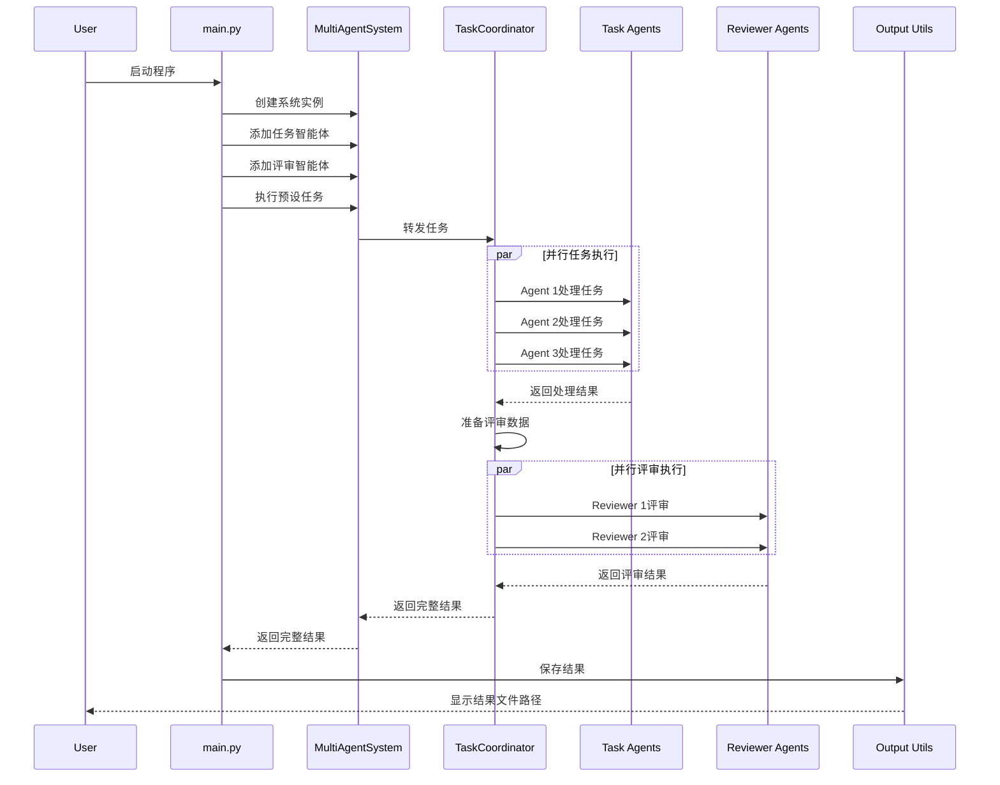
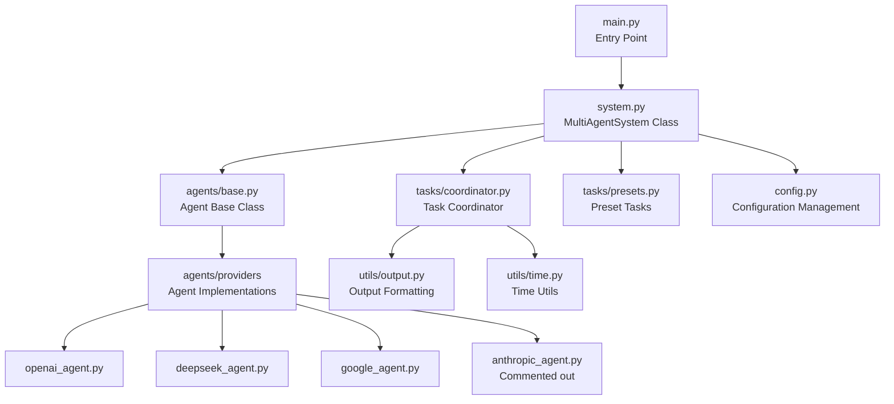
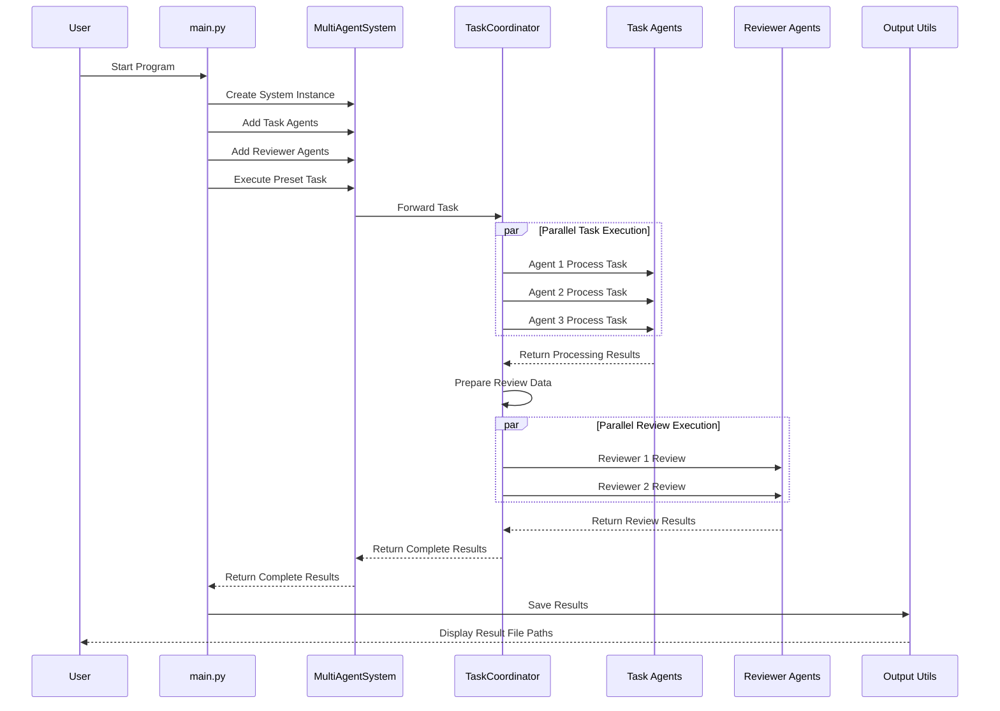

# Multi-Agent-System <button id="langToggle" onclick="toggleLanguage()" style="float:right; padding: 5px 10px; background-color: #4CAF50; color: white; border: none; border-radius: 4px; cursor: pointer;">Switch to English</button>

<div id="chinese-content">

Multi-Agent System: 一个模块化框架，用于协调多个AI智能体执行任务并互相评审工作成果。该系统利用不同提供商的大语言模型，通过并行处理和评审机制提高任务完成的质量和可靠性。

## 系统架构



## 核心模块详解

### 1. 系统配置 (config.py)

**功能**: 管理系统的全局配置，包括API密钥、端点URL和默认模型设置。

**重要参数**:
- `OPENAI_API_KEY`: OpenAI API密钥
- `DEEPSEEK_API_KEY`: DeepSeek API密钥
- `GOOGLE_API_KEY`: Google Gemini API密钥
- 默认模型设置: 各提供商的默认模型名称

**使用方式**:
```python
from config import OPENAI_API_KEY, DEFAULT_OPENAI_MODEL
```

### 2. 智能体基类 (agents/base.py)

**功能**: 定义所有AI智能体的公共接口和基本功能。

**主要组件**:
- `Agent` 抽象基类：定义智能体必须实现的方法
- `_prepare_prompt` 方法：为模型准备统一格式的提示
- 抽象的 `process` 方法：子类必须实现此方法来处理任务

**示例**:
```python
class Agent(ABC):
    def __init__(self, name: str, model: str, provider: str):
        self.name = name
        self.model = model
        self.provider = provider

    @abstractmethod
    async def process(self, input_data: Any, task_instructions: str) -> Dict[str, Any]:
        pass
```

### 3. 特定提供商智能体实现

#### 3.1 OpenAI智能体 (agents/providers/openai_agent.py)
**功能**: 使用OpenAI API实现的智能体。

#### 3.2 DeepSeek智能体 (agents/providers/deepseek_agent.py)
**功能**: 使用DeepSeek API实现的智能体（通过OpenAI兼容接口）。

#### 3.3 Google Gemini智能体 (agents/providers/google_agent.py)
**功能**: 使用Google Gemini API实现的智能体。

#### 3.4 Anthropic智能体 (agents/providers/anthropic_agent.py)
**功能**: 使用Anthropic Claude API实现的智能体（当前已注释，为未来扩展准备）。

### 4. 任务协调器 (tasks/coordinator.py)

**功能**: 协调多个智能体并行执行任务和评审。

**主要流程**:
1. 并行分发任务给所有智能体
2. 收集所有智能体的处理结果
3. 准备评审数据
4. 并行分发评审任务给评审智能体
5. 整合所有结果

**使用示例**:
```python
coordinator = TaskCoordinator(agents, reviewer_agents)
results = await coordinator.execute_task(input_data, task_instructions, review_instructions)
```

### 5. 预设任务 (tasks/presets.py)

**功能**: 定义常用任务的指令和评审标准。

**包含的预设任务**:
- `speech_act_annotation`: 语音行为标注任务
- `sentiment_analysis`: 情感分析任务
- `text_correction`: 文本校对和纠错任务
- `code_review`: 代码审核任务

### 6. 多智能体系统 (system.py)

**功能**: 系统的核心类，管理智能体注册和任务执行。

**主要方法**:
- `add_agent`: 添加新的智能体
- `remove_agent`: 移除智能体
- `list_agents`: 列出所有注册的智能体
- `execute_task`: 执行自定义任务
- `execute_preset_task`: 执行预设任务

### 7. 工具类

#### 7.1 输出工具 (utils/output.py)
**功能**: 将系统结果保存为不同格式（JSON, TXT, HTML）。

#### 7.2 时间工具 (utils/time.py)
**功能**: 提供一致的时间戳格式。

### 8. 主程序入口 (main.py)

**功能**: 程序的入口点，提供命令行界面。

## 数据流程图



## 文件结构

```
multi-agent-system/
├── agents/                      # 智能体相关模块
│   ├── base.py                  # 智能体抽象基类
│   └── providers/               # 各提供商的智能体实现
├── tasks/                       # 任务相关模块
│   ├── coordinator.py           # 任务协调器
│   └── presets.py               # 预设任务定义
├── utils/                       # 工具函数
├── config.py                    # 配置管理
├── system.py                    # 多智能体系统主类
├── main.py                      # 程序入口点
└── requirements.txt             # 依赖项列表
```

## 安装与配置

### 环境要求
- Python 3.9或更高版本
- 有效的API密钥(OpenAI, DeepSeek, Google Gemini)

### 安装步骤

1. 克隆代码库
```bash
git clone https://github.com/yourusername/multi-agent-system.git
cd multi-agent-system
```

2. 创建并激活虚拟环境
```bash
python -m venv venv
source venv/bin/activate  # Unix/MacOS
venv\Scripts\activate     # Windows
```

3. 安装依赖项
```bash
pip install -r requirements.txt
```

4. 配置API密钥
```bash
cp .env.example .env
# 编辑.env文件，添加你的API密钥
```

## 使用方法

### 基本用法
```bash
python main.py              # 运行演示任务
python main.py --list-presets  # 查看可用预设任务
```

### 在代码中使用
```python
import asyncio
from system import MultiAgentSystem

# 创建系统实例
system = MultiAgentSystem()

# 添加智能体
system.add_agent("GPT分析器", "openai", "gpt-4o-mini")
system.add_agent("DeepSeek分析器", "deepseek", "deepseek-v3")
system.add_agent("评审员", "google", "gemini-2.0-flash-lite", is_reviewer=True)

# 执行预设任务
async def run_task():
    results = await system.execute_preset_task("sentiment_analysis", input_data)
    print(results)

asyncio.run(run_task())
```

## 自定义和扩展

### 添加新的智能体提供商
在`agents/providers/`目录中创建新文件并实现继承自`Agent`基类的新智能体类。

### 创建新的预设任务
在`tasks/presets.py`中添加新的预设任务定义。

</div>

<div id="english-content" style="display: none;">

Multi-Agent System: A modular framework for coordinating multiple AI agents to execute tasks and peer review work outputs. The system leverages large language models from different providers, improving task completion quality and reliability through parallel processing and review mechanisms.

## System Architecture



## Core Modules

### 1. System Configuration (config.py)

**Function**: Manages global system configurations, including API keys, endpoint URLs, and default model settings.

**Important Parameters**:
- `OPENAI_API_KEY`: OpenAI API key
- `DEEPSEEK_API_KEY`: DeepSeek API key
- `GOOGLE_API_KEY`: Google Gemini API key
- Default model settings: Default model names for each provider

**Usage**:
```python
from config import OPENAI_API_KEY, DEFAULT_OPENAI_MODEL
```

### 2. Agent Base Class (agents/base.py)

**Function**: Defines common interfaces and basic functionality for all AI agents.

**Main Components**:
- `Agent` abstract base class: Defines methods that agents must implement
- `_prepare_prompt` method: Prepares prompts in a unified format for models
- Abstract `process` method: Must be implemented by subclasses to process tasks

**Example**:
```python
class Agent(ABC):
    def __init__(self, name: str, model: str, provider: str):
        self.name = name
        self.model = model
        self.provider = provider

    @abstractmethod
    async def process(self, input_data: Any, task_instructions: str) -> Dict[str, Any]:
        pass
```

### 3. Provider-Specific Agent Implementations

#### 3.1 OpenAI Agent (agents/providers/openai_agent.py)
**Function**: Agent implementation using the OpenAI API.

#### 3.2 DeepSeek Agent (agents/providers/deepseek_agent.py)
**Function**: Agent implementation using the DeepSeek API (via OpenAI-compatible interface).

#### 3.3 Google Gemini Agent (agents/providers/google_agent.py)
**Function**: Agent implementation using the Google Gemini API.

#### 3.4 Anthropic Agent (agents/providers/anthropic_agent.py)
**Function**: Agent implementation using the Anthropic Claude API (currently commented out, prepared for future expansion).

### 4. Task Coordinator (tasks/coordinator.py)

**Function**: Coordinates multiple agents to execute tasks and reviews in parallel.

**Main Process**:
1. Distribute tasks to all agents in parallel
2. Collect processing results from all agents
3. Prepare review data
4. Distribute review tasks to reviewer agents in parallel
5. Integrate all results

**Usage Example**:
```python
coordinator = TaskCoordinator(agents, reviewer_agents)
results = await coordinator.execute_task(input_data, task_instructions, review_instructions)
```

### 5. Preset Tasks (tasks/presets.py)

**Function**: Defines instructions and review standards for common tasks.

**Included Preset Tasks**:
- `speech_act_annotation`: Speech act annotation task
- `sentiment_analysis`: Sentiment analysis task
- `text_correction`: Text proofreading and correction task
- `code_review`: Code review task

### 6. Multi-Agent System (system.py)

**Function**: Core class of the system, manages agent registration and task execution.

**Main Methods**:
- `add_agent`: Add a new agent
- `remove_agent`: Remove an agent
- `list_agents`: List all registered agents
- `execute_task`: Execute a custom task
- `execute_preset_task`: Execute a preset task

### 7. Utility Classes

#### 7.1 Output Utils (utils/output.py)
**Function**: Saves system results in different formats (JSON, TXT, HTML).

#### 7.2 Time Utils (utils/time.py)
**Function**: Provides consistent timestamp formats.

### 8. Main Program Entry (main.py)

**Function**: Program entry point, provides command-line interface.

## Data Flow Diagram



## File Structure

```
multi-agent-system/
├── agents/                      # Agent-related modules
│   ├── base.py                  # Agent abstract base class
│   └── providers/               # Provider-specific agent implementations
├── tasks/                       # Task-related modules
│   ├── coordinator.py           # Task coordinator
│   └── presets.py               # Preset task definitions
├── utils/                       # Utility functions
├── config.py                    # Configuration management
├── system.py                    # Multi-agent system main class
├── main.py                      # Program entry point
└── requirements.txt             # Dependency list
```

## Installation and Configuration

### Requirements
- Python 3.9 or higher
- Valid API keys (OpenAI, DeepSeek, Google Gemini)

### Installation Steps

1. Clone the repository
```bash
git clone https://github.com/yourusername/multi-agent-system.git
cd multi-agent-system
```

2. Create and activate a virtual environment
```bash
python -m venv venv
source venv/bin/activate  # Unix/MacOS
venv\Scripts\activate     # Windows
```

3. Install dependencies
```bash
pip install -r requirements.txt
```

4. Configure API keys
```bash
cp .env.example .env
# Edit the .env file to add your API keys
```

## Usage

### Basic Usage
```bash
python main.py              # Run demo task
python main.py --list-presets  # View available preset tasks
```

### Using in Code
```python
import asyncio
from system import MultiAgentSystem

# Create system instance
system = MultiAgentSystem()

# Add agents
system.add_agent("GPT Analyzer", "openai", "gpt-4o-mini")
system.add_agent("DeepSeek Analyzer", "deepseek", "deepseek-v3")
system.add_agent("Reviewer", "google", "gemini-2.0-flash-lite", is_reviewer=True)

# Execute preset task
async def run_task():
    results = await system.execute_preset_task("sentiment_analysis", input_data)
    print(results)

asyncio.run(run_task())
```

## Customization and Extension

### Adding New Agent Providers
Create a new file in the `agents/providers/` directory and implement a new agent class inheriting from the `Agent` base class.

### Creating New Preset Tasks
Add new preset task definitions in `tasks/presets.py`.

</div>

<script>
// Add this to the end of your README.md file as a script
// Function to toggle language display
function toggleLanguage() {
  const chineseDiv = document.getElementById('chinese-content');
  const englishDiv = document.getElementById('english-content');
  const toggleBtn = document.getElementById('langToggle');
  
  if (chineseDiv.style.display === 'none') {
    chineseDiv.style.display = 'block';
    englishDiv.style.display = 'none';
    toggleBtn.textContent = 'Switch to English';
  } else {
    chineseDiv.style.display = 'none';
    englishDiv.style.display = 'block';
    toggleBtn.textContent = '切换到中文';
  }
}
</script>
