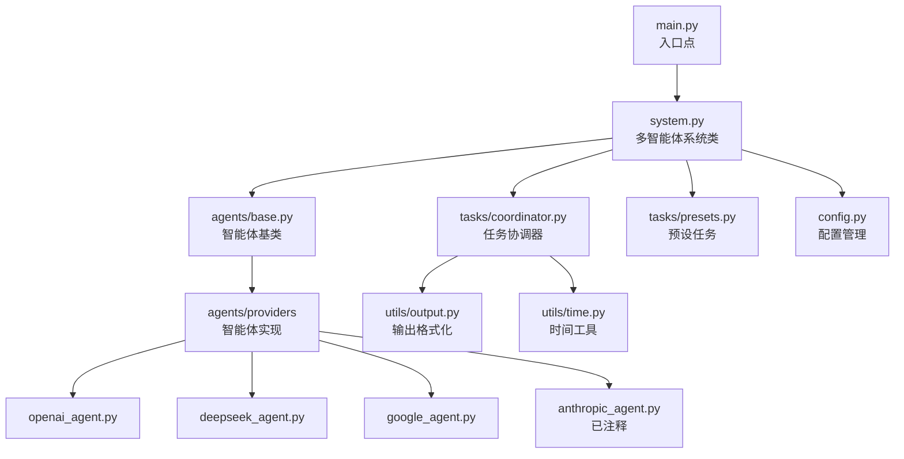
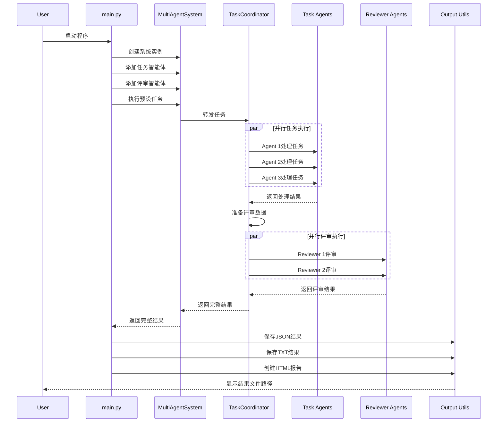

# Multi-Agent-System
Multi-Agent System: A modular framework for coordinating multiple AI agents to execute tasks and peer review work outputs. The system leverages large language models from different providers, improving task completion quality and reliability through parallel processing and review mechanisms.

# 多智能体系统 (Multi-Agent System)

一个模块化框架，用于协调多个AI智能体执行任务并互相评审工作成果。该系统利用不同提供商的大语言模型，通过并行处理和评审机制提高任务完成的质量和可靠性。

## 系统架构



## 核心模块详解

### 1. 系统配置 (config.py)

**功能**: 管理系统的全局配置，包括API密钥、端点URL和默认模型设置。

**重要参数**:

- `OPENAI_API_KEY`: OpenAI API密钥
- `DEEPSEEK_API_KEY`: DeepSeek API密钥
- `GOOGLE_API_KEY`: Google Gemini API密钥
- `OPENAI_BASE_URL`: OpenAI API端点
- 默认模型设置: 各提供商的默认模型名称

**使用方式**:

```python
from config import OPENAI_API_KEY, DEFAULT_OPENAI_MODEL

```

### 2. 智能体基类 (agents/base.py)

**功能**: 定义所有AI智能体的公共接口和基本功能。

**主要组件**:

- `Agent` 抽象基类：定义智能体必须实现的方法
- `_prepare_prompt` 方法：为模型准备统一格式的提示
- 抽象的 `process` 方法：子类必须实现此方法来处理任务

**示例**:

```python
class Agent(ABC):
    def __init__(self, name: str, model: str, provider: str):
        self.name = name
        self.model = model
        self.provider = provider

    @abstractmethod
    async def process(self, input_data: Any, task_instructions: str) -> Dict[str, Any]:
        pass

```

### 3. 特定提供商智能体实现

### 3.1 OpenAI智能体 (agents/providers/openai_agent.py)

**功能**: 使用OpenAI API实现的智能体。

**特点**:

- 使用最新的OpenAI客户端库
- 支持不同的OpenAI模型
- 自动处理JSON响应解析
- 完整的错误处理

### 3.2 DeepSeek智能体 (agents/providers/deepseek_agent.py)

**功能**: 使用DeepSeek API实现的智能体（通过OpenAI兼容接口）。

**特点**:

- 利用OpenAI兼容的API接口
- 支持DeepSeek的模型
- 自动JSON解析和错误处理

### 3.3 Google Gemini智能体 (agents/providers/google_agent.py)

**功能**: 使用Google Gemini API实现的智能体。

**特点**:

- 使用Google的生成式AI客户端库
- 支持Gemini模型系列
- 自动处理不同格式的响应

### 3.4 Anthropic智能体 (agents/providers/anthropic_agent.py)

**功能**: 使用Anthropic Claude API实现的智能体（当前已注释，为未来扩展准备）。

### 4. 任务协调器 (tasks/coordinator.py)

**功能**: 协调多个智能体并行执行任务和评审。

**主要流程**:

1. 并行分发任务给所有智能体
2. 收集所有智能体的处理结果
3. 准备评审数据
4. 并行分发评审任务给评审智能体
5. 整合所有结果

**使用示例**:

```python
coordinator = TaskCoordinator(agents, reviewer_agents)
results = await coordinator.execute_task(input_data, task_instructions, review_instructions)

```

### 5. 预设任务 (tasks/presets.py)

**功能**: 定义常用任务的指令和评审标准。

**包含的预设任务**:

- `speech_act_annotation`: 语音行为标注任务
- `sentiment_analysis`: 情感分析任务
- `text_correction`: 文本校对和纠错任务
- `code_review`: 代码审核任务

**每个预设任务包含**:

- 详细的任务指令
- 评审指令
- 期望的输出JSON格式

### 6. 多智能体系统 (system.py)

**功能**: 系统的核心类，管理智能体注册和任务执行。

**主要方法**:

- `add_agent`: 添加新的智能体
- `remove_agent`: 移除智能体
- `list_agents`: 列出所有注册的智能体
- `execute_task`: 执行自定义任务
- `execute_preset_task`: 执行预设任务

**内部组件**:

- 智能体注册表
- 任务协调器实例
- 预设任务集合

### 7. 工具类

### 7.1 输出工具 (utils/output.py)

**功能**: 将系统结果保存为不同格式。

**支持的格式**:

- JSON: 结构化数据，适合程序处理
- TXT: 人类可读的文本报告
- HTML: 交互式可视化报告，带有样式和布局

**方法**:

- `save_agent_results`: 保存为JSON或TXT
- `create_html_report`: 创建HTML可视化报告

### 7.2 时间工具 (utils/time.py)

**功能**: 提供一致的时间戳格式。

**方法**:

- `get_current_time`: 获取标准格式的当前时间

### 8. 主程序入口 (main.py)

**功能**: 程序的入口点，提供命令行界面。

**主要组件**:

- 命令行参数解析
- 示例任务执行流程
- 预设任务列表显示

**命令行选项**:

- `-demo`: 运行语音行为标注演示
- `-list-presets`: 列出所有可用的预设任务

## 数据流程图

下面是系统处理一个任务的完整数据流程：



## 文件结构详解

```
multi-agent-system/
├── __init__.py                  # 根包初始化文件
├── agents/                      # 智能体相关模块
│   ├── __init__.py              # 智能体包初始化文件
│   ├── base.py                  # 智能体抽象基类
│   └── providers/               # 各提供商的智能体实现
│       ├── __init__.py          # 提供商包初始化文件
│       ├── openai_agent.py      # OpenAI智能体实现
│       ├── deepseek_agent.py    # DeepSeek智能体实现
│       ├── google_agent.py      # Google Gemini智能体实现
│       └── anthropic_agent.py   # Anthropic智能体实现(已注释)
├── tasks/                       # 任务相关模块
│   ├── __init__.py              # 任务包初始化文件
│   ├── coordinator.py           # 任务协调器
│   └── presets.py               # 预设任务定义
├── utils/                       # 工具函数
│   ├── __init__.py              # 工具包初始化文件
│   ├── output.py                # 输出格式化工具
│   └── time.py                  # 时间工具函数
├── agent_results/               # 结果保存目录(运行时创建)
├── config.py                    # 配置管理
├── system.py                    # 多智能体系统主类
├── main.py                      # 程序入口点
├── requirements.txt             # 依赖项列表
├── .env                         # 环境变量(需自行创建)
└── .env.example                 # 环境变量示例

```

## 安装与配置

### 环境要求

- Python 3.9或更高版本
- 有效的API密钥(OpenAI, DeepSeek, Google Gemini)

### 安装步骤

1. 克隆代码库

```bash
git clone <https://github.com/yourusername/multi-agent-system.git>
cd multi-agent-system

```

1. 创建并激活虚拟环境

```bash
# 创建虚拟环境
python -m venv venv

# 激活虚拟环境(Windows)
venv\\Scripts\\activate

# 激活虚拟环境(Unix/MacOS)
source venv/bin/activate

```

1. 安装依赖项

```bash
pip install -r requirements.txt

```

1. 配置API密钥

```bash
# 复制环境变量示例文件
cp .env.example .env

# 编辑.env文件，添加你的API密钥
# 使用你喜欢的文本编辑器
nano .env  # 或者 vim .env, 或其他编辑器

```

## 使用方法

### 基本用法

运行演示任务:

```bash
python main.py

```

查看可用的预设任务:

```bash
python main.py --list-presets

```

明确运行演示:

```bash
python main.py --demo

```

### 在代码中使用

```python
import asyncio
from system import MultiAgentSystem

# 创建系统实例
system = MultiAgentSystem()

# 添加智能体
system.add_agent("GPT分析器", "openai", "gpt-4o-mini")
system.add_agent("DeepSeek分析器", "deepseek", "deepseek-v3")
system.add_agent("评审员", "google", "gemini-2.0-flash-lite", is_reviewer=True)

# 准备输入数据
input_data = [{"id": 1, "text": "示例文本"}]

# 执行预设任务
async def run_task():
    results = await system.execute_preset_task("sentiment_analysis", input_data)
    print(results)

# 运行异步任务
asyncio.run(run_task())

```

## 自定义和扩展

### 添加新的智能体提供商

1. 在`agents/providers/`目录中创建新文件(如`new_provider_agent.py`)
2. 实现继承自`Agent`基类的新智能体类
3. 在`system.py`的`available_agent_types`字典中添加新提供商

示例:

```python
# agents/providers/new_provider_agent.py
from agents.base import Agent

class NewProviderAgent(Agent):
    def __init__(self, name, model="default-model"):
        super().__init__(name, model, "NewProvider")
        # 初始化API客户端

    async def process(self, input_data, task_instructions):
        # 实现处理逻辑
        pass

# 然后在system.py中添加:
self.available_agent_types = {
    # 现有提供商...
    "new_provider": NewProviderAgent
}

```

### 创建新的预设任务

1. 在`tasks/presets.py`中添加新的静态方法
2. 定义任务指令和评审指令
3. 更新`get_all_presets`方法以包含新任务

示例:

```python
@staticmethod
def get_new_task() -> Tuple[str, str]:
    """新预设任务"""
    task_instructions = """
    任务: 描述任务内容...
    """

    review_instructions = """
    任务: 评审说明...
    """

    return task_instructions, review_instructions

# 更新所有预设任务字典
@staticmethod
def get_all_presets() -> Dict[str, Tuple[str, str]]:
    return {
        # 现有预设...
        "new_task": TaskPresets.get_new_task(),
    }

```

### 自定义输出格式

通过修改`utils/output.py`中的方法，可以自定义输出格式或添加新的输出格式。

## 结果示例

运行语音行为标注任务后，系统将生成以下输出文件:

### JSON格式 (agent_results_20250308_123456.json)

```json
{
  "timestamp": "20250308_123456",
  "task_details": {
    "input_data": [
      {"message_id": "1", "text": "请帮我打开窗户。"},
      {"message_id": "2", "text": "外面正在下雨。"},
      ...
    ],
    "instructions": "任务: 识别并标注以下对话中的语音行为类型..."
  },
  "agent_analysis": [
    {
      "agent_name": "GPT-4o分析器",
      "model": "gpt-4o-mini",
      "provider": "OpenAI",
      "status": "success",
      "analysis_results": {
        "annotations": [
          {
            "message_id": "1",
            "text": "请帮我打开窗户。",
            "speech_act": "指令",
            "explanation": "说话者在要求听者执行打开窗户的动作。"
          },
          ...
        ]
      }
    },
    ...
  ],
  "reviewer_assessment": [
    ...
  ]
}

```

### HTML报告预览

HTML报告提供了一个可视化界面，包括:

- 任务详情部分
- 智能体分析结果(带有提供商标识)
- 评审员评估结果
- 可折叠的JSON数据视图
- 彩色标识不同状态和提供商

## 技术细节与考量

### 异步处理

系统使用Python的`asyncio`库实现并行处理，这允许:

- 多个智能体同时处理任务
- 多个评审员同时评审结果
- 无需等待单个API调用完成

### 错误处理

每个智能体实现都包含完整的错误处理，确保:

- API调用失败不会导致整个系统崩溃
- 错误信息被正确捕获并包含在结果中
- 部分失败不会阻止系统生成有用的输出

### JSON解析

智能体响应处理包括:

- 自动提取大语言模型响应中的JSON部分
- 处理不同的JSON格式和位置
- 当JSON解析失败时提供原始响应作为备选

## 贡献与问题反馈

欢迎提交问题报告、功能请求或代码贡献。请通过GitHub的Issue系统提交问题或建议。

## 许可证

[指定您的许可证类型]
